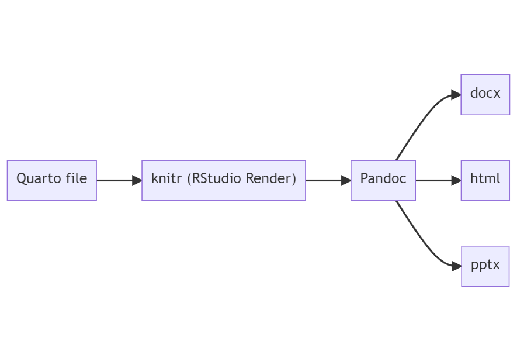

Authoring Research in RStudio
================
Dominic Bordelon, University Library System
October 18, 2022

## Agenda

1.  Overview of workflow and components
2.  Writing documents
3.  Presentation slides
4.  Websites and books
5.  Generating citations and bibliographies
6.  About code chunks
7.  Learning more

## About the presenter

Dominic Bordelon, Research Data Librarian  
University of Pittsburgh Library System  
<dbordelon@pitt.edu>

Support for. . .

-   research data management (data management plans for grant proposals;
    file and project organization)
-   Open Science (esp. data sharing)
-   computer programming for research in R, Python, and SQL (data
    cleaning, analysis, viz, documentation)
-   tools like Git and the Linux command line
-   data ethics, critical data studies

Formats:

-   consultations ([book
    here](https://pitt.libcal.com/appointments/research_data_librarian))
-   presentations and workshops for the Pitt community
-   class visits, lab trainings
-   R and RStudio Drop-In Hour: Tuesdays, 5-6pm (Fall 2022)

## Overview of workflow and components

The Web is written in **HTML**, for example:

```` markdown
```{default}
<h2>Section heading</h2>
<p>Here is some paragraph text.</p>
<p>A bulleted list:</p>
<ul>
  <li>Item 1</li>
  <li>Item 2</li>
  <li>Item 3</li>
</ul>
```
````

In 2004, John Gruber and Aaron Swartz created **Markdown**:

```` markdown
```{default}
## Section heading

Here is some paragraph text.

A bulleted list:

* Item 1
* Item 2
* Item 3
```
````

[**Quarto**](https://quarto.org/) (previously RMarkdown) is an extension
of Markdown which allows for chunks of R code, LaTeX for math, and lots
of configurability. Headers are written in a format called
[YAML](https://yaml.org/spec/1.2.2/) (short for “YAML Ain’t a Markup
Language”).

[**Pandoc**](https://pandoc.org/) is a document conversion tool which
can accept and output many formats. The
[{knitr}](http://yihui.org/knitr/) package uses Pandoc to convert your
Quarto document into one or several desired output files.

We don’t need to use Pandoc directly—we’re simply going to write Quarto
docs and click on RStudio’s Render button.


*Note:* if you want to produce PDFs, you may also need to install a TeX
package such as [MiKTeX](https://miktex.org/).

------------------------------------------------------------------------

<figure>

<figcaption aria-hidden="true">How Quarto rendering works</figcaption>
</figure>

## What can you do with Quarto?

<div>

<table>
<colgroup>
<col style="width: 50%" />
<col style="width: 50%" />
</colgroup>
<tbody>
<tr class="odd">
<td style="text-align: center;"><div width="50.0%"
data-layout-align="center">
<h3 id="without-code">Without code:</h3>
<ul>
<li>Prepare outputs of any non-interactive type</li>
<li>Rich hypertext, images, math LaTeX, footnotes</li>
<li>In-text citations and generated bibliography</li>
<li>Tables (manually entered)</li>
<li>Existing plots (if they were generated somewhere else; insert as
image)</li>
<li>Configure via options in file headers</li>
<li>Visual editor suggested</li>
</ul>
</div></td>
<td style="text-align: center;"><div width="50.0%"
data-layout-align="center">
<h3 id="with-code-r-python">With code (R, Python):</h3>
<ul>
<li>Analysis (expressed as code + output)</li>
<li>Plots</li>
<li>Tables auto-created and/or heavily computed (using <a
href="https://bookdown.org/yihui/rmarkdown-cookbook/kable.html">knitr::kable</a>)</li>
<li>Interactive elements in webpages and presentations</li>
<li>Dashboards, web apps</li>
</ul>
</div></td>
</tr>
</tbody>
</table>

</div>

## Writing documents

-   Simple rich text (bold, italic, code), hyperlinks, headers, and
    blockquotes are available
    -   Headers are important! Quarto treats them as the structure of
        your document (think: introduction, methods, results,
        conclusion—but no need to limit yourself to these)
    -   Suggestion: use the visual editor toolbar rather than typing the
        syntax by hand in the Source editor.
-   LaTeX can be inserted inline, e.g.:
    
    or in display (block) mode
-   Images (SVG, PNG, JPG) can be inserted, scaled, and captioned. Add
    alt-text for accessibility.
-   When you’re ready to convert your Quarto doc to a different format,
    check the `format` field in the header, then click Render.
-   Formats: Word (`docx`), `html`, `pdf` (via LaTeX), GitHub-flavored
    markdown (`gfm`)
-   See accompanying files `lorem-ipsum-paper.qmd`, `.html`, `.docx`,
    and `.pdf`
    -   Text source: [Lorem Ipsum](https://www.lipsum.com/)
-   Docs reference: [Markdown
    Basics](https://quarto.org/docs/authoring/markdown-basics.html),
    [Word Basics](https://quarto.org/docs/output-formats/ms-word.html)

## Presentation slides

-   Formats: Revealjs (browser-based, HTML), PowerPoint (pptx), Beamer
    (LaTeX PDF)
-   The Quarto source document looks the same, but each Heading2 becomes
    a slide title
-   The current presentation was created in Quarto using the `revealjs`
    format (default theme)
-   For Revealjs, important parameters are `scrollable`, `smaller`
    (change default font size), and `self-contained` (create a single
    HTML file including images)
-   See accompanying files `lorem-ipsum-pres.qmd`, `.html`, `.pptx`, and
    `.pdf`
-   Docs reference:
    [Presentations](https://quarto.org/docs/presentations/)

## Websites and books

-   A project of related documents can be compiled into a website or
    book
-   Book formats: HTML, PDF, MS Word, EPUB
-   Book example: Grolemund and Wickham (2014)
-   Since Quarto is still so new, most RMarkdown-authored books you’ll
    find are made in the [{bookdown}](https://bookdown.org/) package.
    Some prominent examples:
    -   Kitzes, Turek, and Deniz (2018)
    -   Silge and Robinson (2017)
    -   Wilke (2019)
-   Another package to look at for HTML output is
    [{pagedown}](https://github.com/rstudio/pagedown), which uses CSS
    styling to make a variety of formats (poster; CV; pdf-style paged
    document)

## Generating citations and bibliographies

-   In the Visual editor, go to Insert
    
    Citation
    -   You can paste a DOI, or search CrossRef and DataCite records
    -   If you use Zotero, this dialog can also access your library
    -   Quarto generates the in-text citation for you, you only need to
        use a token like `@Bordelon2022c`
    -   Cited works are collected into a bib file, whose contents are
        turned into a bibliography at the end of your document
-   You can also bring your own BibTeX file
-   Docs reference: [Technical Writing:
    Citations](https://quarto.org/docs/visual-editor/technical.html#citations),
    [Citations &
    Footnotes](https://quarto.org/docs/authoring/footnotes-and-citations.html)

## About code chunks

-   To insert a code chunk anywhere, press *Ctrl+Alt+I* (Windows) or
    *Cmd+Option+I* (macOS).
-   While working in RStudio, you can run the chunk (or a single line of
    the chunk) anytime
-   When you Render your doc, the usual behavior will be to run every
    chunk, show its code, and then the output of the code.
    -   Each of these is configurable (don’t run chunk, suppress code,
        suppress output) per-chunk or for the whole doc
-   Additional languages supported in Quarto: Python, Julia, Observable
-   Docs reference: [Using
    R](https://quarto.org/docs/computations/r.html), [Execution
    Options](https://quarto.org/docs/computations/execution-options.html)

## Learning more

-   Browse the [docs](https://quarto.org/docs/guide/) or
    [gallery](https://quarto.org/docs/gallery/)
-   Try making a Word document or slide deck
-   Once you’re comfortable making documents and presentations, and
    assuming you’re new to R, a next step could be to learn about data
    visualization with the ggplot2 package, with a goal towards plotting
    some of your own data (perhaps reproducing an existing plot).
-   Support
    -   R and RStudio Drop-In Hour, Hillman Library, Tuesdays, 5-6pm
        (Fall 2022)

    -   Write to me: <dbordelon@pitt.edu>

## References

<div id="refs" class="references csl-bib-body hanging-indent">

<div id="ref-grolemund2014" class="csl-entry">

Grolemund, Garrett, and Hadley Wickham. 2014. *Hands-on Programming with
r: Write Your Own Functions and Simulations*. Sebastopol, CA: O’Reilly
Media.

</div>

<div id="ref-theprac2018" class="csl-entry">

Kitzes, Justin, Daniel Turek, and Fatma Deniz, eds. 2018. *The Practice
of Reproducible Research: Case Studies and Lessons from the
Data-Intensive Sciences*. Oakland, California: University of California
Press. <http://www.practicereproducibleresearch.org/>.

</div>

<div id="ref-silge2017" class="csl-entry">

Silge, Julia, and David Robinson. 2017. *Text Mining with r: A Tidy
Approach*. 1st edition. Beijing ; Boston: O’Reilly Media.

</div>

<div id="ref-wilke2019" class="csl-entry">

Wilke, Claus O. 2019. *Fundamentals of Data Visualization: A Primer on
Making Informative and Compelling Figures*. 1st edition. Sebastopol, CA:
O’Reilly Media.

</div>

</div>
